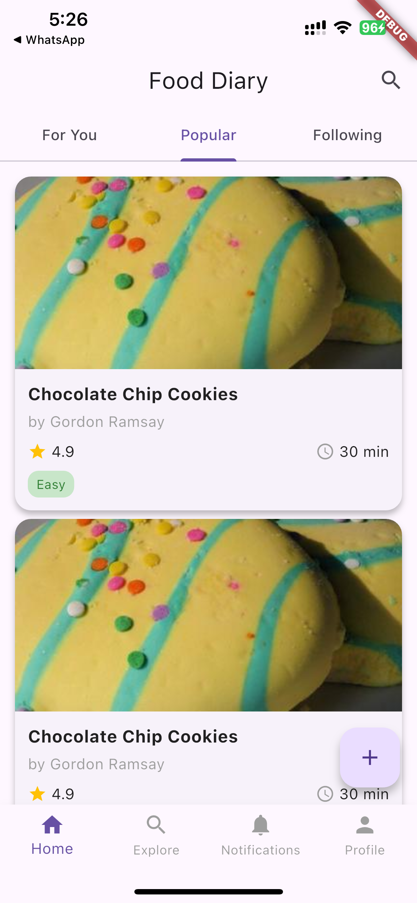

# Food Diary App

A Flutter demo application showcasing the design capabilities of [v0.dev](https://v0.dev). This app demonstrates a modern, beautiful UI for a food diary platform where users can share recipes and showcase their cooked creations.

## 🎨 About This Demo

This project was generated using v0.dev, an AI-powered design tool that can create beautiful, production-ready Flutter UI components and screens. The app serves as a demonstration of what's possible when prompting v0.dev to generate designs for a food diary application.

## ✨ Features

- **Recipe Discovery**: Browse recipes through three curated feeds:
  - **For You**: Personalized recipe recommendations
  - **Popular**: Trending recipes from the community
  - **Following**: Recipes from users you follow

- **Recipe Sharing**: Create and share your own recipes with:
  - Cover photo upload
  - Detailed ingredient lists with quantities
  - Step-by-step cooking instructions
  - Difficulty level and cook time
  - Recipe descriptions

- **Experience Sharing**: Share your cooking experiences and finished dishes

- **User Profiles**: View and manage your profile

- **Recipe Details**: View comprehensive recipe information including ratings, cook time, and difficulty level

- **Modern UI**: Beautiful, intuitive interface with:
  - Material Design components
  - Smooth navigation
  - Responsive layouts
  - Clean typography using Poppins font

## 📱 UI Showcase

Here are some sample screens from the app:

<p align="center">
  
  &nbsp;&nbsp;&nbsp;&nbsp;
  
</p>

## 🏗️ Project Structure

```
lib/
├── main.dart                 # App entry point and routing
├── screens/
│   ├── splash_screen.dart   # Splash/loading screen
│   ├── auth_screen.dart     # Authentication screen
│   ├── home_screen.dart     # Main feed with tabs
│   ├── recipe_detail_screen.dart  # Recipe detail view
│   ├── add_recipe_screen.dart     # Create new recipe
│   ├── add_experience_screen.dart # Share cooking experience
│   └── profile_screen.dart        # User profile
└── widgets/
    ├── bottom_nav.dart      # Bottom navigation bar
    ├── recipe_card.dart     # Recipe card component
    └── experience_card.dart # Experience card component
```

## 🚀 Getting Started

### Prerequisites

- Flutter SDK (3.7.2 or higher)
- Dart SDK
- iOS Simulator / Android Emulator or a physical device

### Installation

1. Clone the repository:
```bash
git clone <repository-url>
cd food_diary
```

2. Install dependencies:
```bash
flutter pub get
```

3. Run the app:
```bash
flutter run
```

## 🛠️ Built With

- **Flutter** - Cross-platform UI framework
- **Material Design** - Design system
- **v0.dev** - AI-powered UI generation

## 📝 Notes

This is a demo application showcasing UI design capabilities. Some features may be placeholders or require backend integration for full functionality.

## 🤝 Contributing

This is a demo project, but feel free to explore the code and learn from the implementation!

## 📄 License

This project is a demo and is provided as-is for demonstration purposes.

---

*Generated with ❤️ using v0.dev*
